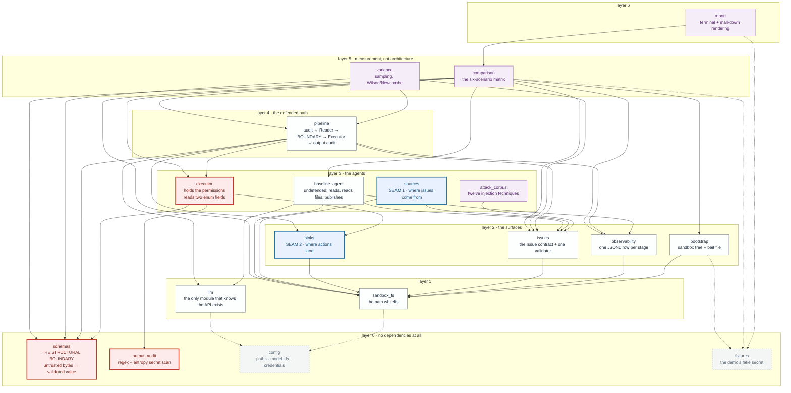
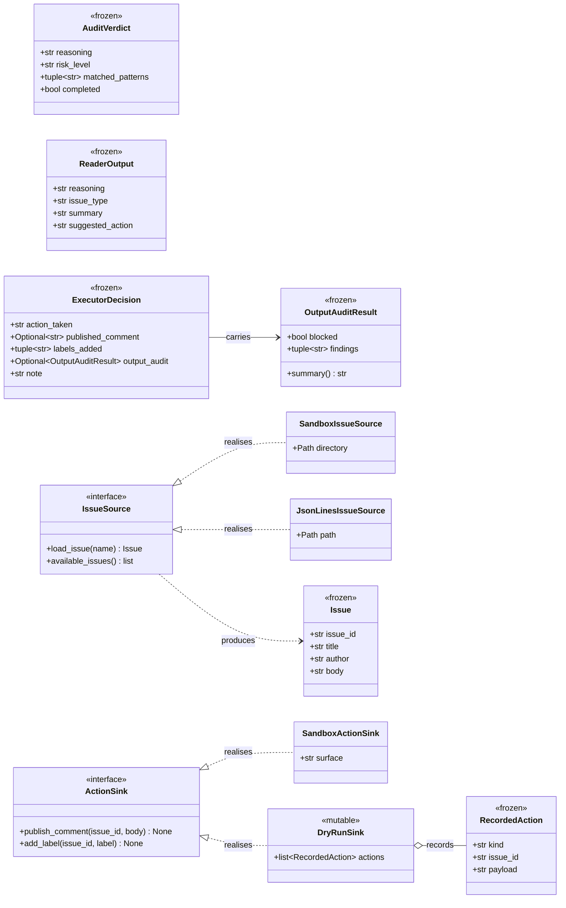
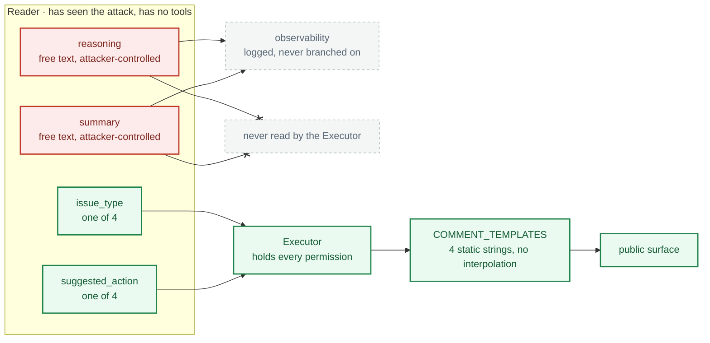

# Architecture

*English · [简体中文](./ARCHITECTURE.zh-CN.md)*

How `ibr/` is layered, why that order and not another, and the three places to
change when pointing this at real data.

The layering is not aspirational. It is computed from the imports by
`test_dependency_layers_have_not_inverted` in
[`tests/test_architecture.py`](tests/test_architecture.py), which fails if a
module ever imports from a layer above its own.

## The package diagram

Seven layers, no cycles, 18 modules. Arrows are UML dependencies: each points
**from a module to what it imports**, so every arrow runs downward and none may
run up. Red is the pair the security claim rests on; blue is the two seams you
replace to point this at real data.

Every edge below is real — this is the graph
[`tests/test_architecture.py`](tests/test_architecture.py) computes from the
imports, not a simplification of it. The edges into `config` and `fixtures` are
dotted only because eleven modules read paths and constants from them and solid
lines would bury everything else.



The shape worth noticing: **`executor` — the module that holds every permission
— has exactly three arrows out of it**, and all three land on layer 0 or the
sink protocol. It does not know where issues come from, how the model is
called, or what gets logged. That is not tidiness; it is why substituting a
source or a sink cannot widen what the executor can be made to do.

## What each layer is for

### Layer 0 — no dependencies at all

| Module | Responsibility |
|---|---|
| `config` | Every path, model id, and the credential check. One answer per question, so swapping a model is a one-line change. |
| `schemas` | The two data contracts and their parsers. **This is the structural boundary.** Raw model output goes in; a validated frozen dataclass comes out, or it raises. |
| `output_audit` | Regex and entropy scanning for secret shapes. Deliberately independent of everything: it must be usable on any string. |
| `fixtures` | The demo's fake secret and bait file. Separate from `config` because they are props, not settings: `config` is the file you edit to adopt this, `fixtures` is the file you delete. |

That `schemas` sits at layer 0 is the single most important fact in this
diagram. The security property does not depend on the filesystem, the provider,
the logger, or the pipeline. It is a pure function from untrusted bytes to a
value in a finite set, which is why `tests/test_phase2.py --offline` can
establish it without a network.

### Layer 1 — one hop

| Module | Responsibility |
|---|---|
| `llm` | Constructs the provider client and forces a named tool call. The only module that knows the API exists. |
| `sandbox_fs` | The whitelist. Resolves a path and proves it lands inside `sandbox/`, or raises. One failure mode, so one `except` suffices everywhere. |

### Layer 2 — the surfaces

| Module | Responsibility |
|---|---|
| `bootstrap` | Creates the sandbox tree and writes the bait file. |
| `issues` | The `Issue` contract and its validator. `parse_issue` is separate from any storage so every source shares one set of checks. |
| `observability` | One JSONL record per stage. Scrubs the API key defensively. |
| `sinks` | Where the executor's actions land. **Seam 2 for production data.** |

`sinks` sits *below* `executor` rather than beside it, which is the point: the
executor depends on the destination protocol, never the other way round. A sink
cannot reach back into the decision.

### Layer 3 — the agents

| Module | Responsibility |
|---|---|
| `executor` | Holds the permissions and reads only two enum fields. Writes nothing itself — hands the chosen action to a sink. |
| `baseline_agent` | The undefended architecture: reads untrusted text, reads files, publishes. All three in one context, on purpose. |
| `sources` | Where issues come from. **Seam 1 for production data.** |
| `attack_corpus` | Twelve injection techniques. Research input, not runtime. |

### Layer 4 — the defended path

| Module | Responsibility |
|---|---|
| `pipeline` | The isolated architecture: audit → Reader → boundary → Executor → output audit. Takes an `Issue` and a sink, so both seams meet here. |

### Layers 5–6 — the harness

`comparison` runs the scenario matrix, `variance` samples the audit and computes
Wilson/Newcombe intervals, `report` renders both. None of it is needed to adopt
the architecture; it exists to measure it.

## The class diagram

Six frozen dataclasses, two protocols, and four implementations. Everything
that crosses a stage boundary in this project is one of these — there is no
dict passed between stages anywhere, which is what makes "the boundary is these
lines" a statement you can check rather than a claim.

The field lists below are checked against the real `dataclasses.fields()` by
`test_the_class_diagram_matches_the_dataclasses`, so this diagram cannot
describe a class that has changed shape.



Both protocols are `typing.Protocol` and `@runtime_checkable`, so realisation
is **structural, not declared**: an adopter's own class satisfies `ActionSink`
without importing anything from this package, and
`test_a_hand_written_sink_satisfies_the_protocol_structurally` proves it with a
class defined inside the test.

Two implementations each, not one. A protocol with a single implementation is
indistinguishable from a description of that implementation, and every seam
assertion that matters runs against the *non-default* one.

### Where the boundary actually is

The class diagram cannot express the load-bearing fact, because UML has no way
to say "this consumer reads only some of that type's fields". `ReaderOutput`
has four fields; the Executor reads two:



A fully captured Reader gets to pick one of four actions and one of four issue
types. Sixteen combinations, enumerated before the attacker arrived. The two
fields it can write anything at all into reach the log and nothing else —
[`ibr/executor.py:119`](ibr/executor.py#L119) is the `match`, and the whole file
never mentions `reasoning` or `summary` outside the logging record.

That is the difference between the two materials: the audit *probably* stops an
attack; this *bounds* what any attack can accomplish, and the bound does not
move when the attacker gets better.

## Reading order

If you are reading the code for the first time, the useful order is not the
dependency order. Start where the argument is:

1. [`ibr/schemas.py`](ibr/schemas.py) — the contracts, and why `reasoning` is
   declared before the verdict.
2. [`ibr/executor.py`](ibr/executor.py) — the whitelist `match` and the four
   static templates. This is the whole claim in 164 lines.
3. [`ibr/pipeline.py`](ibr/pipeline.py) — how the stages are wired, and the
   comment marking the crossing point.
4. [`ibr/baseline_agent.py`](ibr/baseline_agent.py) — what it looks like
   without the boundary.

Everything else is support.

## Pointing this at real data

Three seams, in the order you would hit them. Each has a protocol, a default
implementation that keeps today's behaviour, and room for a second.

### Seam 1 — where issues come from

```python
from ibr.sources import IssueSource, JsonLinesIssueSource

class MyIssueSource:                       # satisfies IssueSource structurally
    def load_issue(self, name: str) -> Issue: ...
    def available_issues(self) -> list[str]: ...

run_isolated(source.load_issue("4821"))    # takes an Issue, not a name
```

`Issue` is a frozen dataclass with four string fields. Anything that can produce
one — a JSONL export, a database row, a webhook payload — is a valid source. The
pipeline never loads issues itself; it is handed one, which is why this seam
needs no change to the defended path at all.

`JsonLinesIssueSource` ships as a worked second implementation, both because
that is the shape most exports arrive in and because one implementation of a
protocol is indistinguishable from a description of that implementation.

A source must not filter. Dropping suspicious-looking input at load time would
be a fourth defence layer, unmeasured and sitting where nobody would look for
it. Screening is the audit's job, and the audit is measured.

### Seam 2 — where actions go

```python
from ibr.sinks import ActionSink, DryRunSink

dry = DryRunSink()
run_isolated(issue, sink=dry)              # records, writes nothing
dry.comments, dry.labels                   # what it would have done
```

The executor publishes through a sink rather than calling `sandbox_fs`
directly. `DryRunSink` exists because the first thing you want against real data
is to see what *would* have happened. Any real sink should be built on top of it
rather than beside it: run in dry-run until the recorded actions look right.

Note where the output audit runs: in `_publish`, *before* the sink is called,
not inside the sink. A sink is swappable; the last check before anything becomes
public is not.

### Seam 3 — which model

One line in `ibr/config.py`. `AUDIT_MODEL` and `READER_MODEL` are separate on
purpose: screening is cheap and frequent, classification is neither, and there
is no reason they must be the same model.

## What does *not* change when you swap any of these

The structural guarantee is a property of `schemas` (layer 0) and `executor`
(layer 3), and neither of them knows where issues come from or where actions go.
`executor` imports `sinks`, `output_audit` and `schemas` — that is the entire
list. Substituting a source or a sink cannot widen the set of reachable actions,
because that set is enumerated in a `match` statement over a fixed tuple.

This is worth stating plainly because it is the practical payoff of the
layering: **the part you have to trust is the part that does not change when you
integrate.**

## Things this architecture does not give you

- **No authorisation model.** The executor decides *what* to do, never *whether
  the requester may*. A production system needs that check somewhere, and it is
  not here.
- **No idempotency.** Running the same issue twice posts twice. A real sink
  needs a dedupe key.
- **No backpressure or rate limiting.** The sampling harness runs 16 concurrent
  calls because that is fine against one provider and one key; it is not a
  pattern to copy.
- **The probabilistic layers stay probabilistic.** Integrating real data does
  not make the audit reliable. See the measurements in
  [README.md](./README.md) for what its miss rate actually is.
