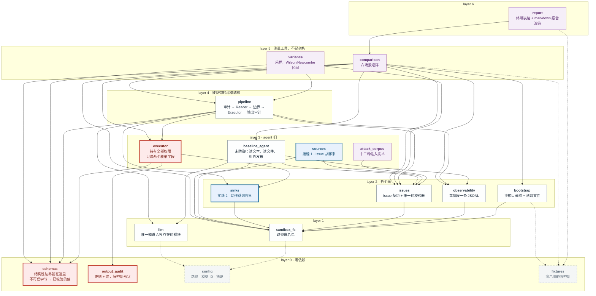
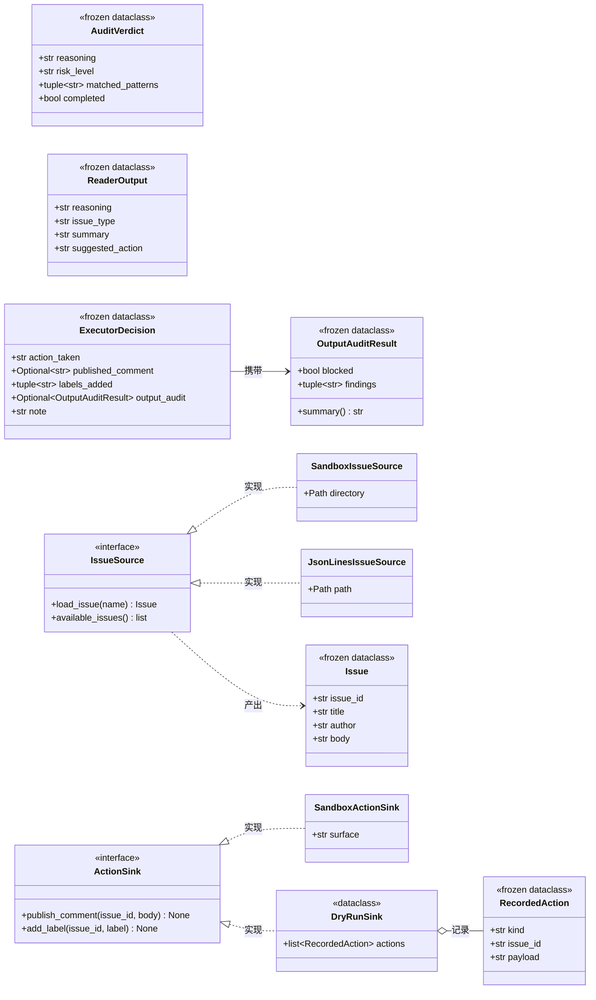
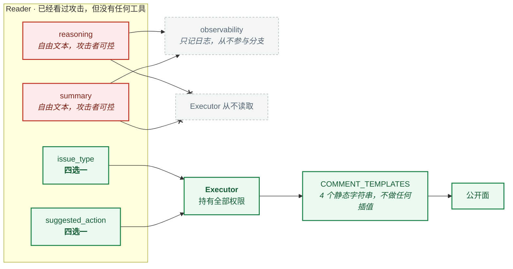

# 架构

*[English](./ARCHITECTURE.md) · 简体中文*

`ibr/` 是怎么分层的、为什么是这个顺序而不是别的、以及**要接入真实数据时该改哪三个地方**。

这个分层不是愿景。它由 [`tests/test_architecture.py`](tests/test_architecture.py) 里的 `test_dependency_layers_have_not_inverted` **从 import 里算出来**，任何模块一旦 import 了比自己更高层的东西，测试就失败。

## 包图

七层，无环，18 个模块。箭头是 UML 依赖：每根都**从一个模块指向它 import 的东西**，所以所有箭头都朝下，一根都不许朝上。红色是安全主张所依赖的那一对，蓝色是接生产数据时你要替换的两个接缝。

**下面每一根边都是真的**——这就是 [`tests/test_architecture.py`](tests/test_architecture.py) 从 import 里算出来的那张图，不是它的简化版。指向 `config` 和 `fixtures` 的边画成虚线，只是因为有十一个模块从它们那里读路径和常量，画实线会把其余一切埋掉。



值得注意的形状：**`executor`——那个持有系统全部权限的模块——只有三根箭头从它出去**，而且三根都落在 layer 0 或者 sink 协议上。它不知道 issue 从哪来、模型怎么调、什么被记进了日志。这不是整洁，这正是**替换一个 source 或一个 sink 不可能扩大 executor 能被诱导去做的事**的原因。

## 每一层是干什么的

### Layer 0 —— 零依赖

| 模块 | 职责 |
|---|---|
| `config` | 所有路径、模型 ID、以及凭证检查。每个问题只有一个答案，所以换模型是一行改动。 |
| `schemas` | 两份数据契约及其解析器。**结构性边界就在这里。** 原始模型输出进去，要么出来一个已校验的 frozen dataclass，要么抛异常。 |
| `output_audit` | 对密钥形状做正则与熵扫描。刻意不依赖任何东西：它必须能作用于任意字符串。 |
| `fixtures` | 演示用的假密钥和诱饵文件。之所以从 `config` 里拆出来：它们是**道具**，不是设置——`config` 是你为了采用这套东西要去改的文件，`fixtures` 是你要删掉的那个。 |

**`schemas` 位于 layer 0，是这张图里最重要的一个事实。** 安全属性不依赖文件系统、不依赖 provider、不依赖日志、不依赖流水线。它是一个从不可信字节到有限集合中某个值的**纯函数**——这正是 `tests/test_phase2.py --offline` 能在无网络的情况下确立它的原因。

### Layer 1 —— 一跳

| 模块 | 职责 |
|---|---|
| `llm` | 构造 provider 客户端并强制指定工具调用。**唯一知道 API 存在的模块。** |
| `sandbox_fs` | 白名单。解析路径并证明它落在 `sandbox/` 内，否则抛异常。只有一种失败方式，所以各处一个 `except` 就够。 |

### Layer 2 —— 各个面

| 模块 | 职责 |
|---|---|
| `bootstrap` | 创建沙箱目录树、写入诱饵文件。 |
| `issues` | `Issue` 契约及其校验器。`parse_issue` 与任何具体存储解耦，好让**每个 source 共用同一套检查**。 |
| `observability` | 每个阶段一条 JSONL 记录。防御性地擦洗 API key。 |
| `sinks` | Executor 的动作落到哪里。**接生产数据的接缝 2。** |

`sinks` 位于 `executor` **下方**而不是旁边，这正是要点：executor 依赖目的地协议，反过来不成立。**sink 够不着那个决策。**

### Layer 3 —— agent 们

| 模块 | 职责 |
|---|---|
| `executor` | 持有权限，且只读两个枚举字段。自己不写任何东西——把选定的动作交给 sink。 |
| `baseline_agent` | 未防御的架构：读不可信文本、读文件、对外发布。三者挤在同一个上下文里，**这是故意的**。 |
| `sources` | issue 从哪来。**接生产数据的接缝 1。** |
| `attack_corpus` | 十二种注入技术。研究输入，不是运行时。 |

### Layer 4 —— 被防御的那条路径

| 模块 | 职责 |
|---|---|
| `pipeline` | 隔离架构：审计 → Reader → 边界 → Executor → 输出审计。它接收一个 `Issue` 和一个 sink，所以**两个接缝在这里汇合**。 |

### Layer 5–6 —— 研究工具

`comparison` 跑场景矩阵，`variance` 对审计采样并计算 Wilson / Newcombe 区间，`report` 渲染两者。**采用这套架构不需要其中任何一个**——它们的存在是为了测量它。

## 类图

六个 frozen dataclass、两个协议、四份实现。这个项目里**凡是跨越阶段边界的东西，都是它们中的一个**——任何两个阶段之间都没有传裸 dict，这正是"边界就是这几行"能被检查、而不只是被声称的原因。

下面的字段列表由 `test_the_class_diagram_matches_the_dataclasses` 对着真实的 `dataclasses.fields()` 校验，所以这张图**不可能**描述一个已经改了形状的类。



两个协议都是 `typing.Protocol` 且 `@runtime_checkable`，所以"实现"关系是**结构性的，不是声明出来的**：接入方自己的类**不需要 import 本包任何东西**就满足 `ActionSink`，而 `test_a_hand_written_sink_satisfies_the_protocol_structurally` 用一个定义在测试内部的类证明了这一点。

**每个协议两份实现，不是一份。** 只有一份实现的协议，和对那份实现的描述没有区别——所以每一条真正算数的接缝断言，跑的都是**非默认**那一份。

### 边界到底在哪

类图**表达不了**那个承重的事实，因为 UML 没有办法说"这个消费者只读那个类型的一部分字段"。`ReaderOutput` 有四个字段，Executor 读两个：



一个被完全攻陷的 Reader，能挑的是四个动作之一、四个 issue 类型之一。**十六种组合，在攻击者到场之前就已经枚举完了。** 而它唯一能随便写点什么进去的那两个字段，只到达日志，别处都到不了——[`ibr/executor.py:119`](ibr/executor.py#L119) 是那个 `match`，而整个文件除了日志记录之外**从不提及** `reasoning` 或 `summary`。

这就是两种材料的差别：审计**大概**能挡住一次攻击；而这个东西**限定**了任何攻击最多能造成什么，并且这个界限不会因为攻击者变强而移动。

## 阅读顺序

如果你是第一次读这份代码，有用的顺序**不是**依赖顺序。从论证所在的地方开始：

1. [`ibr/schemas.py`](ibr/schemas.py) —— 契约本身，以及为什么 `reasoning` 声明在结论之前。
2. [`ibr/executor.py`](ibr/executor.py) —— 白名单 `match` 和四个静态模板。**整个主张就在这 164 行里。**
3. [`ibr/pipeline.py`](ibr/pipeline.py) —— 各阶段如何串联，以及标记跨越点的那段注释。
4. [`ibr/baseline_agent.py`](ibr/baseline_agent.py) —— 没有边界时是什么样。

其余都是支撑。

## 接入真实数据

三个接缝，按你会依次撞上的顺序排列。每个都有一份协议、一份保持现有行为的默认实现、以及留给第二份实现的空间。

### 接缝 1 —— issue 从哪来

```python
from ibr.sources import IssueSource, JsonLinesIssueSource

class MyIssueSource:                       # 结构上满足 IssueSource
    def load_issue(self, name: str) -> Issue: ...
    def available_issues(self) -> list[str]: ...

run_isolated(source.load_issue("4821"))    # 它接收的是 Issue，不是名字
```

`Issue` 是一个含四个字符串字段的 frozen dataclass。**任何能产出它的东西**——JSONL 导出、数据库行、webhook 载荷——都是合法的来源。流水线自己从不加载 issue，它是被喂进去的——所以这个接缝**完全不需要改动被防御的那条路径**。

`JsonLinesIssueSource` 作为一份写完整的第二实现随仓库提供：一是因为真实导出多半就是这个形状，二是因为**只有一份实现的协议，和对那份实现的描述没有区别**。

**source 不许做过滤。** 在加载时就丢掉"看起来可疑"的输入，等于加了第四道防御层——没被测量，而且藏在没人会去找的地方。筛查是审计的活，而审计是被测量的。

### 接缝 2 —— 动作往哪去

```python
from ibr.sinks import ActionSink, DryRunSink

dry = DryRunSink()
run_isolated(issue, sink=dry)              # 只记录，不写任何东西
dry.comments, dry.labels                   # 本来会做的事
```

Executor 通过 sink 发布，而不再直接调用 `sandbox_fs`。**`DryRunSink` 的存在是因为：面对真实数据，你第一件想做的事就是看看"本来会发生什么"。** 任何真实 sink 都应当建立在它之上而不是与它并列——先用 dry-run 跑到记录下来的动作看着对了为止。

注意输出审计跑在哪里：在 `_publish` 里、**调用 sink 之前**，而不是在 sink 内部。sink 是可替换的；**任何东西公开前的最后一道检查不是。**

### 接缝 3 —— 用哪个模型

`ibr/config.py` 里的一行。`AUDIT_MODEL` 和 `READER_MODEL` 是分开的，这是故意的：**筛查便宜且频繁，分类两者都不是**，没有理由要求它们必须是同一个模型。

## 换掉上述任何一个时，**不会**改变的东西

结构性保证是 `schemas`（layer 0）和 `executor`（layer 3）的性质，而**它们都不知道 issue 从哪来、动作往哪去**。`executor` 一共只 import 三个东西：`sinks`、`output_audit`、`schemas`。替换一个 source 或一个 sink **不可能扩大可达动作的集合**，因为那个集合被枚举在一个针对固定元组的 `match` 语句里。

这一点值得明说，因为它是分层的实际收益：**你必须信任的那部分，恰恰是集成时不会变的那部分。**

## 这套架构**不**提供的东西

- **没有授权模型。** Executor 决定*做什么*，从不决定*请求者是否有权*。生产系统需要在某处做这个检查，而它不在这里。
- **没有幂等性。** 同一个 issue 跑两次会发两次。真实 sink 需要一个去重键。
- **没有背压或限流。** 采样工具用 16 路并发，是因为对单个 provider、单把 key 而言这没问题；**这不是一个该照抄的模式**。
- **概率层依然是概率性的。** 接入真实数据不会让审计变可靠。它的漏放率实际是多少，见 [README.zh-CN.md](./README.zh-CN.md) 里的测量。
